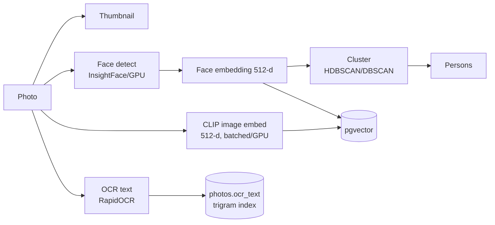

# PhotoSphere AI — AI Pipeline

How images become searchable, recognizable data — all locally, no cloud. Covers
the face pipeline (Module 2/3) and the **AI Search subsystem** (CLIP).

---

## Stages



All stages run in the background pipeline (`viewer/tasks.PipelineWorker`) off the
UI thread, are **incremental** (only new photos), **batched**, **cancel-safe**
(committed batches persist), and report progress. The stages are **plugins** run
by a `PluginManager` — see [PLUGINS.md](PLUGINS.md) for how to add one.

---

## AI Search subsystem (CLIP)

Modular by design: the engine depends on an **embedding backend interface**, not
on CLIP. Adding SigLIP or another local model later means implementing one
interface — storage, search, and UI are untouched.

```
search/
  embedding_backend.py   # EmbeddingBackend protocol (+ l2_normalize)
  clip_backend.py        # ClipBackend (open_clip, lazy, batched, GPU/CPU) + default_backend()
  embedding_cache.py     # TextEmbeddingCache (LRU + disk) for repeated queries
  embedding_engine.py    # incremental, batched image embedding -> clip_embeddings
  search_engine.py       # text -> vector -> pgvector top-K -> ranked results
```

### Backend interface

Every backend exposes `model_id`, `version`, `dim`, `encode_images(list[Image]) ->
(N, dim)`, `encode_text(str) -> (dim,)`, returning **L2-normalized** float32
vectors (so cosine = dot, matching pgvector's cosine index).

The first backend is **CLIP ViT-B-32/openai** (512-d, light). Change the model
via `PHOTOSPHERE_CLIP_MODEL` / `PHOTOSPHERE_CLIP_PRETRAINED`; a
different-dimension model requires recreating the `clip_embeddings` table (its
vector size is fixed in `schema.sql`).

### Indexing (write path)

```
new photo -> stream (no embedding for this model) -> batch of N -> GPU encode
          -> upsert clip_embeddings(photo_id, vector, model, version) -> commit
```

Incremental: `stream_photos_needing_clip` skips photos already embedded for the
active `model`+`version`. Batched: `clip_batch_size` (default 64) images per GPU
call. Embeddings are **versioned by model**, so a future upgrade knows which are
stale — bump `PHOTOSPHERE_CLIP_VERSION` (or change the model) and Re-index.

### Search (read path)


`SearchEngine.search(query, limit, filters=None)` encodes the text (cached),
pulls a candidate pool from pgvector, applies **structured filters**, and
**re-ranks across signals** — this is the unified search platform:

- **Filters** (`filters` dict): `favorite` (bool), `since`/`until` (dates),
  `person_id`. Applied in SQL (`db.search_candidates`) so ranking runs on the
  right subset.
- **Faces × CLIP**: a person *name* typed in the query is auto-detected
  (`find_person_id_by_exact_name`) and added as a person filter — so
  "Ram at the beach" narrows to Ram's photos and ranks them by "at the beach".
- **Blended ranking**: `final = similarity + w_favorite·favorite +
  w_recency·recency` (weights `PHOTOSPHERE_SEARCH_FAVORITE_BOOST` /
  `..._RECENCY_BOOST`). CLIP dominates; favorites and recency break ties.
- **OCR signal (now)**: photos whose extracted `ocr_text` matches the query are
  merged into the candidate pool and boosted (`PHOTOSPHERE_SEARCH_OCR_BOOST`), so
  "passport" / "invoice" find document photos even when CLIP alone would miss
  them. Text match uses a `pg_trgm` index.
- **Extensible**: object labels plug in next the same way — the same
  candidate-pool → filter → rank shape, no API change.

Searches run on a background thread so the UI never blocks (the first query may
load the model). **Favorites** are a user signal: the photo viewer's ♥ toggle
(`F`) sets `photos.is_favorite`, which feeds ranking.

### Storage

`clip_embeddings(photo_id PK, embedding vector(512), model, version, created_at,
updated_at)` with an `ivfflat` cosine index — see [DATABASE.md](DATABASE.md).

---

## Running it

In the app, **Import** / **Re-index** build the search index automatically (the
"Indexing search" stage). Or headless:

```bash
python -m scripts.index_search        # embed new photos (incremental)
```

Then use the **Search** tab: type "dog on a beach", "sunset", "passport", etc.

Requires `open_clip_torch` + a CUDA build of PyTorch (see
[INSTALL.md](INSTALL.md)); if absent, the pipeline skips the search stage and
the Search tab explains how to enable it. Everything stays offline after the
one-time model download.

---

## Testing

The subsystem is tested headlessly with a **stub backend** (deterministic
vectors) — incremental + batched embedding, storage, the pgvector top-K query,
and the text cache — with no GPU or model download. See `tests/test_search.py`.
The face pipeline uses the same stub approach.
