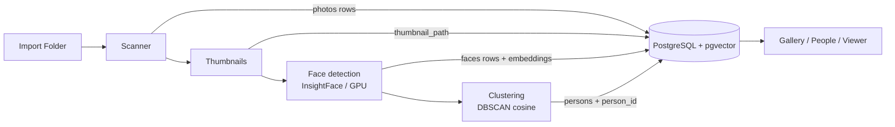

# PhotoSphere AI — Architecture

A fully **offline** AI photo manager. Everything — storage, face recognition,
clustering, the UI — runs on the local machine; nothing is sent to any cloud
service.

This document explains how the pieces fit together. For the schema see
[DATABASE.md](DATABASE.md); for contributor setup see
[DEVELOPMENT.md](DEVELOPMENT.md).

---

## 1. Layered overview

```
┌───────────────────────────────────────────────────────────────┐
│  Desktop UI  (viewer/*, PySide6/Qt)                            │
│  shell · gallery · people · viewer · status/progress          │
└───────────────▲───────────────────────────────▲───────────────┘
                │ read (viewer/data.py)          │ background jobs
                │                                │ (viewer/tasks.py, QThread)
┌───────────────┴───────────────┐   ┌────────────┴──────────────┐
│  Read helpers                 │   │  Pipeline stages          │
│  database.db.list_* / stats   │   │  scanner · thumbnails ·   │
│                               │   │  faces · clustering       │
└───────────────▲───────────────┘   └────────────▲──────────────┘
                │                                 │
                │        database/db.py (all named helpers, no inline SQL)
                └────────────────┬────────────────┘
                                 ▼
                   PostgreSQL + pgvector  (single source of truth)
```

**Key rule:** every read and write goes through a named helper in
`database/db.py`. No module writes inline SQL, and the UI never touches the
database directly — it calls `viewer/data.py`, which calls `database.db`.

---

## 2. Data flow (import → browse)



The whole chain runs as one background job (`viewer/tasks.PipelineWorker`) so
the UI stays responsive; the gallery appears as soon as scanning starts and
fills in as later stages complete.

---

## 3. Modules

| Area | Package | Responsibility |
|------|---------|----------------|
| Config | `config/` | Env-overridable settings (DB, paths, batch sizes, model + cluster params). No import-time side effects. |
| Logging | `utils/logging_setup.py` | Dual file (`logs/photosphere.log`, rotating) + console logging. |
| Database | `database/` | `schema.sql` (idempotent) + `db.py` (all named helpers, transactions, pgvector). Single source of truth. |
| **Scanner** (M1) | `scanner/` | Walk a tree, extract EXIF + SHA-256, dedup, store `photos`. Streams; never crashes on a bad file. |
| Thumbnails | `thumbnails/` | Cache EXIF-oriented JPEG thumbnails to `data/thumbnails`, set `thumbnail_path`. |
| **Faces** (M2) | `faces/` | InsightFace detection → 512-d embeddings into `faces` (GPU, CPU fallback). Detector hidden behind a `FaceDetector` protocol. |
| **Clustering** (M3) | `clustering/` | DBSCAN over cosine distance groups faces into `persons`; fills `person_id`. |
| **Viewer** (M4) | `viewer/` | Native PySide6/Qt desktop UI + the background pipeline worker. |
| Entry points | `scripts/` | CLIs (`scan`, `detect_faces`, `cluster_faces`, `generate_thumbnails`), the app (`app`), and `setup_check`. |

Modules are strictly layered: `viewer` → `viewer.data` → `database.db`; the
pipeline stages (`scanner`, `thumbnails`, `faces`, `clustering`) depend on
`database.db` and `config`, never on `viewer`.

---

## 4. Threading model

Qt requires all widget work on the main (GUI) thread. Long work runs on
workers, and results return via **signals** (Qt marshals them to the GUI
thread):

- **`PipelineWorker(QThread)`** (`viewer/tasks.py`) runs scan → thumbnails →
  faces → clustering. It emits `step_changed`, `progress(done,total)`,
  `finished_ok`, `cancelled`, and `failed`. Cancellation is cooperative: the
  progress callback raises `PipelineCancelled` at the next tick; committed
  batches persist, so **Continue** resumes where **Stop** left off.
- **Thumbnail decoding** (`viewer/gallery.py`) runs on a `QThreadPool`: a
  worker decodes a `QImage` (thread-safe), then the model converts it to a
  `QPixmap` on the GUI thread and caches it (bounded LRU). The grid never blocks
  on disk I/O.

Each worker opens its **own** database connections (psycopg2 connections are
not shared across threads).

---

## 5. Performance & scale

Designed for 100k–500k photos:

- **Streaming, not slurping.** The scanner walks the tree with a generator; the
  face and thumbnail stages stream pending photos through **server-side
  cursors**; embeddings are the only bulk-in-memory step (clustering).
- **Batched transactions** with per-photo `SAVEPOINT`s: one bad file rolls back
  only itself, and a crash loses at most one batch.
- **Incremental gallery**: `canFetchMore`/`fetchMore` paging + async thumbnails
  keep memory flat and scrolling smooth.
- **Indexes** on every hot column, plus an `ivfflat` cosine index on face
  embeddings for similarity.

---

## 6. Design principles

- **Offline only** — no cloud/API calls anywhere; all inference is local
  (InsightFace via onnxruntime, DBSCAN via scikit-learn).
- **Idempotent everything** — re-running any stage is safe and resumes work;
  the schema applies cleanly to a fresh or existing database and never drops a
  table.
- **Forward-compatible schema** — `photos` already carries `ocr_text`,
  `caption`, `clip_embedding`, and GPS columns so future modules (OCR, semantic
  search, timeline/map) need no migration. See [DATABASE.md](DATABASE.md).
- **Single source of truth** — PostgreSQL holds all state; caches
  (`data/thumbnails`, `data/face_crops`) are regenerable and never authoritative.
- **Testability** — heavy dependencies sit behind seams (the `FaceDetector`
  protocol, injectable detector factories, read helpers) so the pipeline and UI
  are tested headlessly without a GPU. See [DEVELOPMENT.md](DEVELOPMENT.md).
