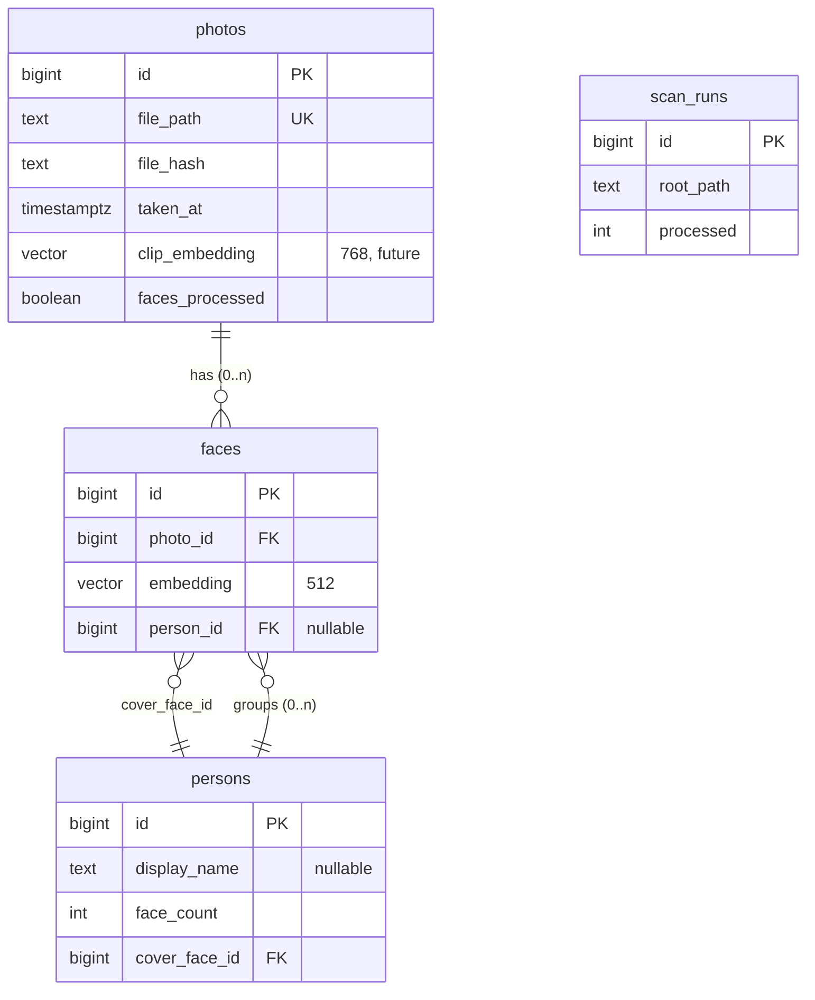

# PhotoSphere AI — Database Reference

PostgreSQL (14–18) with the **pgvector** extension is the single source of
truth. The schema lives in [`database/schema.sql`](../database/schema.sql) and
is **idempotent**: it is applied automatically on first use (and by every
pipeline entry point), can be re-applied safely, and never drops a table.

All access goes through named helper functions in
[`database/db.py`](../database/db.py) — there is no inline SQL elsewhere.

---

## Entity relationships



- A **photo** has **many faces** (`faces.photo_id → photos.id`, `ON DELETE CASCADE`).
- A **person** groups **many faces** (`faces.person_id → persons.id`,
  `ON DELETE SET NULL` — deleting a person un-groups its faces, never deletes them).
- `persons.cover_face_id → faces.id` (`ON DELETE SET NULL`) is the representative face.

---

## `photos`

One row per unique image file. Written by the scanner; enriched by thumbnails
and later modules.

| Column | Type | Notes |
|--------|------|-------|
| `id` | bigint PK | identity |
| `file_path` | text **unique** | absolute path; the dedup/rescan key |
| `file_hash` | text | SHA-256 of file bytes (exact-duplicate detection) |
| `file_size` | bigint | bytes |
| `file_mtime` | timestamptz | filesystem modified time |
| `width`, `height` | integer | pixels (nullable) |
| `format` | text | e.g. `JPEG`, `PNG` |
| `taken_at` | timestamptz | EXIF DateTimeOriginal (nullable) |
| `camera_make`, `camera_model` | text | EXIF (nullable) |
| `orientation` | smallint | EXIF orientation tag |
| `gps_latitude`, `gps_longitude` | double precision | decimal degrees (nullable) |
| `ocr_text` | text | **future** (OCR module) |
| `caption` | text | **future** (AI captions) |
| `clip_embedding` | vector(768) | **future** (semantic search) |
| `is_favorite` | boolean | user flag, default false |
| `thumbnail_path` | text | cached thumbnail under `data/thumbnails` |
| `faces_processed` | boolean | has the face module run on this photo? |
| `created_at`, `updated_at` | timestamptz | housekeeping |

**Indexes:** `file_path` (unique), `file_hash`, `taken_at`, `is_favorite`, and
a partial index on `faces_processed WHERE faces_processed = FALSE` (fast "what's
left to process").

The `ocr_text` / `caption` / `clip_embedding` / GPS columns exist **now** so
future modules attach without an `ALTER TABLE`.

---

## `faces`

One row per detected face. Many faces may reference one photo.

| Column | Type | Notes |
|--------|------|-------|
| `id` | bigint PK | identity |
| `photo_id` | bigint FK → photos | `ON DELETE CASCADE` |
| `bbox_x/y/w/h` | integer | bounding box in source pixels |
| `det_score` | real | detector confidence |
| `embedding` | vector(512) | **raw** InsightFace embedding (not normalized) |
| `crop_path` | text | cached face crop under `data/face_crops` |
| `person_id` | bigint FK → persons | `ON DELETE SET NULL`; NULL = ungrouped |
| `created_at` | timestamptz | |

**Indexes:** `photo_id`, `person_id`, and an `ivfflat` cosine index on
`embedding` (`vector_cosine_ops`, `lists = 100`) for similarity search.

Embeddings are stored **exactly** as the model produces them; normalization for
comparison happens at query time via the cosine (`<=>`) operator.

---

## `persons`

A group of faces believed to be the same individual (created by clustering).

| Column | Type | Notes |
|--------|------|-------|
| `id` | bigint PK | identity |
| `display_name` | text | user-assignable name (nullable; UI feature) |
| `face_count` | integer | members in the group |
| `cover_face_id` | bigint FK → faces | representative face (`ON DELETE SET NULL`) |
| `centroid` | vector(512) | profile = running-average of the person's face embeddings; a fast secondary recognition signal |
| `adaptive_threshold` | real | per-person acceptance bar from gallery consistency; NULL = use the global default (see [LEARNING.md](LEARNING.md)) |
| `created_at`, `updated_at` | timestamptz | |

The default update (`update_people`) is **incremental and name-preserving**:
existing people are kept, new faces fold in, and only genuinely new faces form
new groups. A destructive rebuild (`recluster`, clearing `persons`) is opt-in.

---

## `person_embeddings`

A person's **representative gallery** — a diverse, quality-gated set of face
embeddings powering recognition across appearances (viewpoint, facial hair,
glasses, lighting, age). Matching a new face against this set (best match) is far
more robust than one centroid. See [LEARNING.md](LEARNING.md).

| Column | Type | Notes |
|--------|------|-------|
| `id` | bigint PK | identity |
| `person_id` | bigint FK → persons | `ON DELETE CASCADE` |
| `face_id` | bigint FK → faces | `ON DELETE CASCADE`; `UNIQUE` (one row per face) |
| `embedding` | vector(512) | L2-normalized face embedding |
| `quality` | real | 0..1 quality score gating whether it may teach |
| `is_representative` | boolean | in the diverse subset actually used for matching |
| `created_at` | timestamptz | |

**Indexes:** `(person_id)` and a partial index over `WHERE is_representative`
(the small, hot matching set). Rows cascade away with their person or face.

---

## `recognition_feedback`

Durable memory of the user's corrections, so an automatic assignment they
rejected is never repeated (see [LEARNING.md](LEARNING.md)).

| Column | Type | Notes |
|--------|------|-------|
| `id` | bigint PK | identity |
| `face_id` | bigint FK → faces | `ON DELETE CASCADE` |
| `person_id` | bigint FK → persons | `ON DELETE CASCADE` |
| `verdict` | text | `'reject'` (not this person) or `'confirm'` (reserved) |
| `created_at` | timestamptz | |

`UNIQUE (face_id, person_id)` — one verdict per pair. `fetch_rejections` reads
this into the recognition engine's blocklist each run.

---

## `recognition_suggestions`

Active learning: a face whose best match lands just below a person's threshold
becomes a pending "Is this \<name\>?" question instead of being dropped.

| Column | Type | Notes |
|--------|------|-------|
| `id` | bigint PK | identity |
| `face_id` | bigint FK → faces | `ON DELETE CASCADE`; `UNIQUE` (one suggestion per face) |
| `person_id` | bigint FK → persons | `ON DELETE CASCADE` — the proposed person |
| `score` | real | best cosine to that person |
| `created_at` | timestamptz | |

Cleared when the face is assigned (confirmed or clustered) or the user answers.
`list_suggestions_for_person` returns only suggestions whose face is still
ungrouped.

---

## `clip_embeddings`

Per-photo CLIP image embedding for semantic search, versioned by model.

| Column | Type | Notes |
|--------|------|-------|
| `photo_id` | bigint PK FK → photos | `ON DELETE CASCADE`; one active model per photo |
| `embedding` | vector(512) | L2-normalized CLIP image vector (ViT-B-32) |
| `model` | text | e.g. `ViT-B-32/openai` |
| `version` | integer | bump to force re-embedding with the same model |
| `created_at`, `updated_at` | timestamptz | |

**Indexes:** `(model, version)` for the incremental "needs embedding" query, and
an `ivfflat` cosine index on `embedding`. The vector size is fixed at 512
(ViT-B-32); a different-dimension model requires recreating this table.

## `scan_runs`

An audit log of each scan, powering the dashboard's recent-activity feed and the
CLI summary.

| Column | Type | Notes |
|--------|------|-------|
| `id` | bigint PK | identity |
| `root_path` | text | folder scanned |
| `started_at`, `finished_at` | timestamptz | |
| `processed`, `skipped`, `duplicates`, `errors` | integer | counters |

---

## Helper functions (in `database/db.py`)

Grouped by area — this is the full public surface the rest of the app uses.

- **Connections:** `connection()` (commit/rollback context), `open_connection()`
  (standalone), `apply_schema()`.
- **Photos:** `insert_photo`, `photo_path_exists`, `hash_exists`, `count_photos`,
  `photos_by_ids`.
- **Faces:** `insert_face`, `mark_photo_faces_processed`,
  `iter_photos_pending_faces`, `stream_photos_pending_faces`,
  `delete_faces_for_photo`, `reset_faces_processed`, `count_faces`,
  `count_photos_pending_faces`.
- **Persons/clustering:** `fetch_face_vectors`, `fetch_ungrouped_face_vectors`,
  `fetch_ungrouped_faces`, `fetch_person_face_rows`, `count_ungrouped_faces`,
  `clear_persons`, `create_person`, `assign_faces_to_person`,
  `set_person_centroid`, `fetch_person_centroids`, `update_person_profile`,
  `count_persons`, `list_persons_with_cover`, `rename_person`, `delete_person`,
  `merge_persons`.
- **Representative gallery (recognition v2):** `add_person_embeddings_from_faces`
  (bulk; embeddings copied server-side from `faces`, never through Python),
  `fetch_person_gallery`, `set_person_representatives`, `set_adaptive_threshold`,
  `fetch_person_representatives`, `clear_person_gallery`, `persons_missing_gallery`.
- **Feedback memory (recognition):** `record_feedback`, `fetch_rejections`,
  `unassign_person_faces_in_photos`, `recompute_person_profile`,
  `list_person_representatives_detail`, `detach_faces`.
- **Active learning (suggestions):** `record_suggestion`, `delete_suggestion`,
  `delete_grouped_suggestions`, `list_suggestions_for_person`, `count_suggestions`.
- **Merge scan (anti-fragmentation):** tables `person_merge_suggestions` /
  `person_merge_rejections` (ordered pairs, cascade with either person);
  helpers `replace_merge_suggestions`, `fetch_merge_rejections`,
  `record_merge_rejection`, `list_merge_suggestions_detail`, `fetch_person_names`.
- **Context fusion:** `fetch_person_context_rows`, `fetch_faces_photo_context`.
- **Thumbnails:** `stream_photos_needing_thumbnail`, `set_thumbnail_path`,
  `count_photos_needing_thumbnail`.
- **UI reads:** `library_stats`, `list_photo_grid`, `get_photo_detail`,
  `recent_scan_runs`.
- **CLIP / search:** `stream_photos_needing_clip`, `count_photos_needing_clip`,
  `upsert_clip_embedding`, `count_clip_embeddings`, `search_photos_by_clip`,
  `search_candidates`, `set_favorite`, `find_person_id_by_exact_name`.
- **OCR:** `stream_photos_needing_ocr`, `count_photos_needing_ocr`,
  `set_ocr_text`, `count_ocr_texts`, `search_photos_by_ocr`.
- **Scan runs:** `start_scan_run`, `finish_scan_run`.

---

## Common queries

```sql
-- Library size
SELECT count(*) FROM photos;

-- Biggest people
SELECT id, display_name, face_count FROM persons ORDER BY face_count DESC LIMIT 10;

-- Faces most similar to face 1 (cosine distance via pgvector)
SELECT id FROM faces
ORDER BY embedding <=> (SELECT embedding FROM faces WHERE id = 1)
LIMIT 5;

-- What still needs face detection
SELECT count(*) FROM photos WHERE faces_processed = FALSE;
```

## Reset / undo

```sql
-- Clear people (faces keep their embeddings; person_id is nulled by the FK)
DELETE FROM persons;

-- Clear faces
TRUNCATE faces RESTART IDENTITY;
UPDATE photos SET faces_processed = FALSE;

-- Full wipe (also removes photos + scan history)
TRUNCATE faces, photos, scan_runs RESTART IDENTITY CASCADE;
DELETE FROM persons;
```

Caches under `data/thumbnails` and `data/face_crops` are regenerable and safe to
delete at any time.
