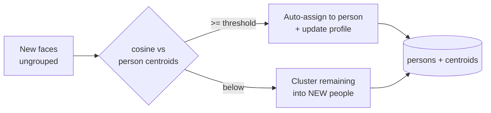

# PhotoSphere AI — Self-Improving Recognition

The key design shift: PhotoSphere AI is not "AI run on photos," it is a **local
knowledge base about your collection that grows smarter from your actions**. The
models (InsightFace, CLIP) stay fixed; the knowledge built on top of them
improves. This stays 100% offline.

## Person profiles + incremental recognition (implemented)

Each person has a **profile**: `persons.centroid`, the running-average of their
face embeddings. When new faces arrive, they are matched against these profiles
before any clustering:

Why this matters:

- **Naming teaches the app.** Name cluster → "Ram" once; future faces of Ram are
  recognized automatically (`clustering/incremental.assign` via centroid match).
  *(Levels 1–2)*
- **Names are never destroyed.** Import / Re-index now run an **incremental,
  name-preserving** update (`update_people`) — existing people are kept and new
  faces fold into them; only genuinely new faces form new groups. The old
  behavior wiped and rebuilt every person (losing names) on each run; that is
  now an explicit opt-in: `scripts.cluster_faces --rebuild`. *(Level 4)*
- **Running-average profiles.** Each recognized face updates the person's
  centroid, so the representation improves across angles/lighting over time.
  *(Level 2)*
- **Confidence gating.** Only matches above `PHOTOSPHERE_FACE_MATCH_THRESHOLD`
  (cosine, default 0.55) are auto-assigned; uncertain faces are left ungrouped
  rather than misfiled. *(Level 14)*
- **Fast.** Existing people are not recomputed from scratch on every import —
  only new faces are matched/clustered. *(Level 4)*

User corrections already feed the loop: **rename** sets a person's name,
**merge** recomputes the merged centroid, **delete** un-groups faces — all via
`database/db.py` helpers, and the next update respects them.

## The knowledge base

| Signal | Where | Status |
|--------|-------|--------|
| Faces + embeddings | `faces` | ✅ |
| Person profiles (centroids) | `persons.centroid` | ✅ |
| CLIP image embeddings | `clip_embeddings` (versioned by model) | ✅ |
| GPS / camera / time metadata | `photos` | ✅ |
| OCR text | `photos.ocr_text` | ⬜ planned |
| Object/scene labels | `photo_objects` | ⬜ planned |
| User behavior (opens, favorites) | planned | ⬜ |

## Roadmap of remaining "levels"

Built on the same principle (fixed models, growing knowledge):

- **L3 — Feedback history**: record accepted/rejected matches, manual merges/
  splits; bias future decisions.
- **L5 — Objects** (YOLO/RT-DETR, offline) → `photo_objects`, searchable.
- **L6 — OCR** (RapidOCR/PaddleOCR, offline) → `photos.ocr_text`, searchable.
- **L7 — Behavior ranking**: opens/favorites/recency blended into search ranking
  (the `SearchEngine.search(filters=…)` hook is already reserved).
- **L8 — Similar photos**: nearest-neighbour over `clip_embeddings` (index exists).
- **L9 — Hybrid recognition**: combine face + time + GPS + companions for
  confidence when the face signal alone is weak.
- **L11 — Active learning**: ask "Is this Ram?" only when confidence is
  borderline; each answer improves the profile.
- **L12 — Embedding versioning**: already done for CLIP (model+version); apply
  the same to face embeddings for model upgrades.
- **L13 — Personal classifier**: a lightweight kNN/logistic-regression head over
  embeddings per library (no GPU retraining) as an alternative to centroid match.

See [ROADMAP.md](ROADMAP.md) for milestone ordering and
[AI_PIPELINE.md](AI_PIPELINE.md) for the pipeline internals.
