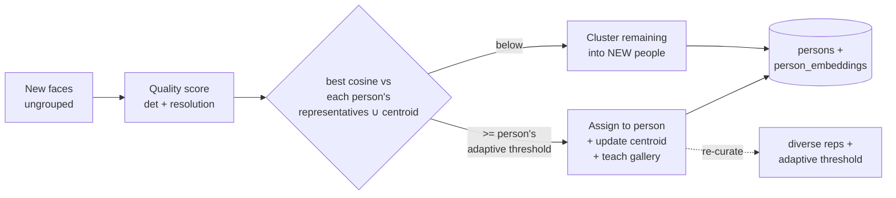

# PhotoSphere AI — Self-Improving Recognition

The key design shift: PhotoSphere AI is not "AI run on photos," it is a **local
knowledge base about your collection that grows smarter from your actions**. The
models (InsightFace, CLIP) stay fixed; the knowledge built on top of them
improves. This stays 100% offline.

## Persistent person identity — recognition engine v2 (implemented)

The goal is not "recognize the same face" but **recognize the same *person*
despite viewpoint, facial hair, glasses, lighting, expression, age, and partial
occlusion** — the thing Google Photos does well. We do it the way they do: a
strong fixed embedding model (InsightFace) wrapped in a smart recognition system
that keeps a **diverse, evolving profile per person**, not a single average.

Each person carries a **representative gallery** (`person_embeddings`) — a
quality-gated, diverse set of embeddings covering their different appearances —
plus a centroid (`persons.centroid`) as a fast secondary signal and a per-person
**adaptive threshold** (`persons.adaptive_threshold`).

Why this matters:

- **Multiple representatives, not one centroid.** A new face is scored by its
  **best** match across a person's stored appearances (front, profile, bearded,
  bespectacled, low-light…). Matching the closest *appearance* instead of a
  blurry average is what recognizes a person across big visual changes.
  (`clustering/gallery.select_representatives`, keeping a diverse set — near-
  duplicates are dropped, capped at `PHOTOSPHERE_PERSON_MAX_REPRESENTATIVES`.)
  *(Stage 1)*
- **Quality gates learning.** Every face gets a 0..1 quality score
  (`clustering/quality.face_quality`, from detector confidence + resolution; blur
  is a designed-in optional term). A tiny/low-confidence detection is shown but
  **never teaches** a profile — below `PHOTOSPHERE_FACE_QUALITY_STORE_MIN` it is
  ignored for learning. *(Stage 2)*
- **Multi-stage match.** Representatives **and** centroid are fused (best-of), so
  a strong match to any stored appearance *or* the average accepts. *(Stage 4)*
- **Adaptive per-person thresholds.** Each person's acceptance bar is derived
  from how *consistent* their gallery is (`clustering/gallery.adaptive_threshold`)
  — a tight identity demands a stricter match (fewer false accepts); a genuinely
  varied person gets a more permissive bar (so real variations still land) —
  clamped to `[PHOTOSPHERE_ADAPTIVE_THRESHOLD_MIN, …_MAX]`, falling back to the
  global `PHOTOSPHERE_FACE_MATCH_THRESHOLD` until there is enough evidence.
  *(Stage 11)*
- **Adaptive learning.** Each accepted face folds into the centroid *and* the
  gallery, then the diverse set + threshold are re-curated — so recognition
  improves as the library grows (20 → 500 photos of a person). *(Stage 6)*
- **Naming teaches the app; names are never destroyed.** Import / Re-index run
  the **incremental, name-preserving** update (`update_people`); existing people
  and their names are kept. A one-time **backfill** upgrades people grouped
  before the gallery existed with no reclustering. Destructive rebuild stays
  opt-in: `scripts.cluster_faces --rebuild`. *(Stage 6)*
- **Model-replaceable.** Nothing hard-codes Buffalo_L; the gallery is embedding-
  agnostic. A future face model (Buffalo_M, AdaFace, MagFace) drops in behind the
  same interface. *(Future model improvements)*

User corrections feed the loop: **rename** sets a name, **merge** reassigns faces
and **rebuilds the target's gallery** (re-curating representatives + threshold),
**delete** un-groups faces — all via `database/db.py` helpers; the next update
respects them.

- **Feedback memory — corrections stick.** On a person's page, select photos →
  **"Not <name>"**: the faces are detached *and* a durable **rejection** is
  recorded (`recognition_feedback`). Recognition consults these on every run, so
  a (face, person) the user rejected is **never re-assigned** — even though its
  embedding still matches. Emptying a person deletes the group (its rejections
  cascade away). Rejections are per-face, so correcting one photo never blocks a
  genuinely new photo of the same person. *(Stage 10)*

### Deferred stages (next increments)

- **Stage 5 — Context fusion**: same day / event / camera / GPS / companions
  raise confidence when the face signal alone is borderline (needs event/GPS
  grouping first).
- **Stage 9 — Active learning**: ask "Is this Ram?" only when confidence is
  borderline; store the answer (the `recognition_feedback` `confirm` verdict is
  reserved for exactly this).
- **Stage 12 — Representative gallery UI**: show each person's learned
  appearances (quality / pose / date) so users see what the system knows.

## The knowledge base

| Signal | Where | Status |
|--------|-------|--------|
| Faces + embeddings | `faces` | ✅ |
| Person profiles (centroids) | `persons.centroid` | ✅ |
| Representative galleries + adaptive thresholds | `person_embeddings`, `persons.adaptive_threshold` | ✅ |
| CLIP image embeddings | `clip_embeddings` (versioned by model) | ✅ |
| GPS / camera / time metadata | `photos` | ✅ |
| OCR text | `photos.ocr_text` (trigram-indexed) | ✅ |
| Favorites | `photos.is_favorite` (feeds search ranking) | ✅ |
| Recognition feedback (rejections) | `recognition_feedback` | ✅ |
| Object/scene labels | `photo_objects` | ⬜ planned |

## Roadmap of remaining "levels"

Built on the same principle (fixed models, growing knowledge):

- **L3 — Feedback history**: record accepted/rejected matches, manual merges/
  splits; bias future decisions.
- **L5 — Objects** (YOLO/RT-DETR, offline) → `photo_objects`, searchable.
- **L6 — OCR** (RapidOCR/PaddleOCR, offline) → `photos.ocr_text`, searchable.
- **L7 — Behavior ranking**: opens/favorites/recency blended into search ranking
  (the `SearchEngine.search(filters=…)` hook is already reserved).
- **L8 — Similar photos**: nearest-neighbour over `clip_embeddings` (index exists).
- **L9 — Hybrid recognition**: combine face + time + GPS + companions for
  confidence when the face signal alone is weak.
- **L11 — Active learning**: ask "Is this Ram?" only when confidence is
  borderline; each answer improves the profile.
- **L12 — Embedding versioning**: already done for CLIP (model+version); apply
  the same to face embeddings for model upgrades.
- **L13 — Personal classifier**: a lightweight kNN/logistic-regression head over
  embeddings per library (no GPU retraining) as an alternative to centroid match.

See [ROADMAP.md](ROADMAP.md) for milestone ordering and
[AI_PIPELINE.md](AI_PIPELINE.md) for the pipeline internals.
